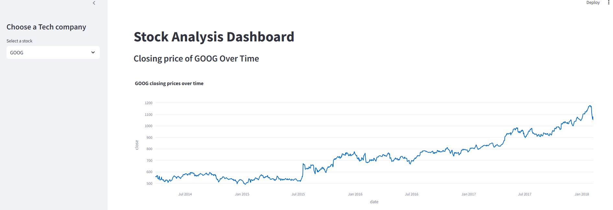
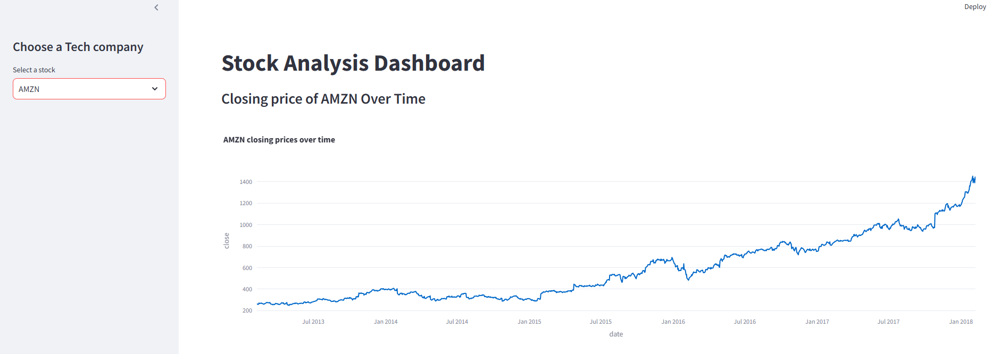
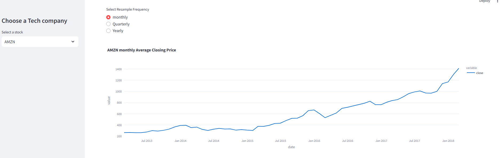
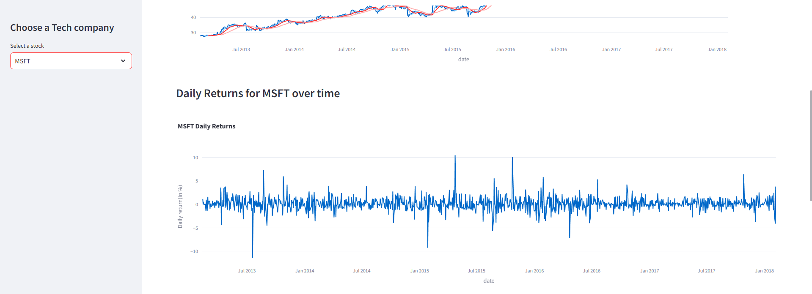
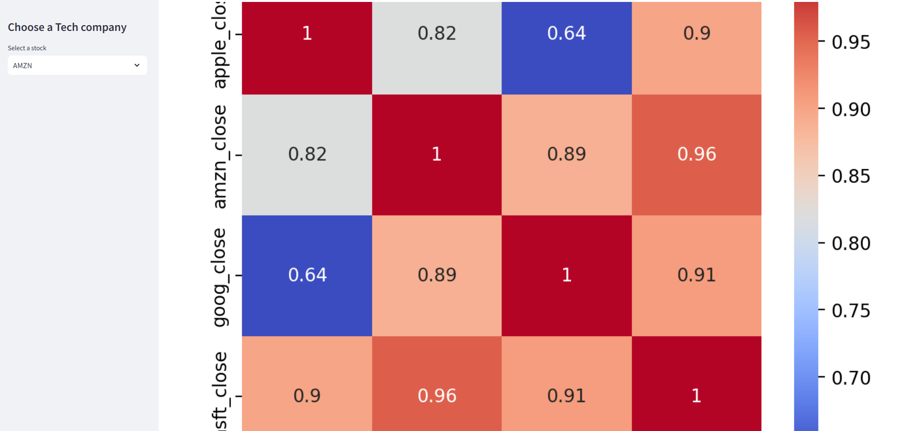

# 📈 Stock Analysis Dashboard (Streamlit)


An interactive **Stock Market Analysis Dashboard** built using **Python & Streamlit** to visualize historical stock prices of major tech companies.

---

## 🚀 Features

- Select a tech company from the sidebar
- Interactive closing price trend
- Moving averages (10, 20, 50 days)
- Daily returns (%) visualization
- Monthly / Quarterly / Yearly resampled prices
- Correlation heatmap of stock closing prices

---

## 🏢 Companies Covered

- Apple (AAPL)
- Amazon (AMZN)
- Google (GOOG)
- Microsoft (MSFT)

---

## 🛠️ Tech Stack


- **Programming Language:** Python 3.9+
- **Framework:** Streamlit
- **Libraries:** Pandas, NumPy, Plotly, Seaborn, Matplotlib
- **Notebook:** Jupyter Notebook
- **Visualization:** Plotly, Seaborn
- **Version Control:** Git & GitHub

---


## ▶️ How to Run the App

### 1️⃣ Install dependencies
```bash
pip install streamlit pandas numpy matplotlib seaborn plotly

 Run the Streamlit app
streamlit run app.py

 Open in browser
http://localhost:8501
```
## 📊 Dashboard Outputs
1️⃣ Closing Price Over Time

Shows historical closing prices of the selected stock.


## 2️⃣ Moving Averages (10, 20, 50 days)

Helps identify trends and smooth price fluctuations.


## 3️⃣ Daily Returns (%)

Displays daily percentage change in stock price.


## 4️⃣ Resampled Closing Prices

Analyze prices at:

Monthly

Quarterly

Yearly


## 5️⃣ Correlation Heatmap

Shows correlation between stock closing prices.

## 📊 Dashboard Screenshots

### 📈 Google Closing Price


---

### 📉 Amazon Closing Price


---

### 📊 Average Closing Price


---

### 📈 Daily Returns Over Time


---

### 🔥 Correlation Heatmap

